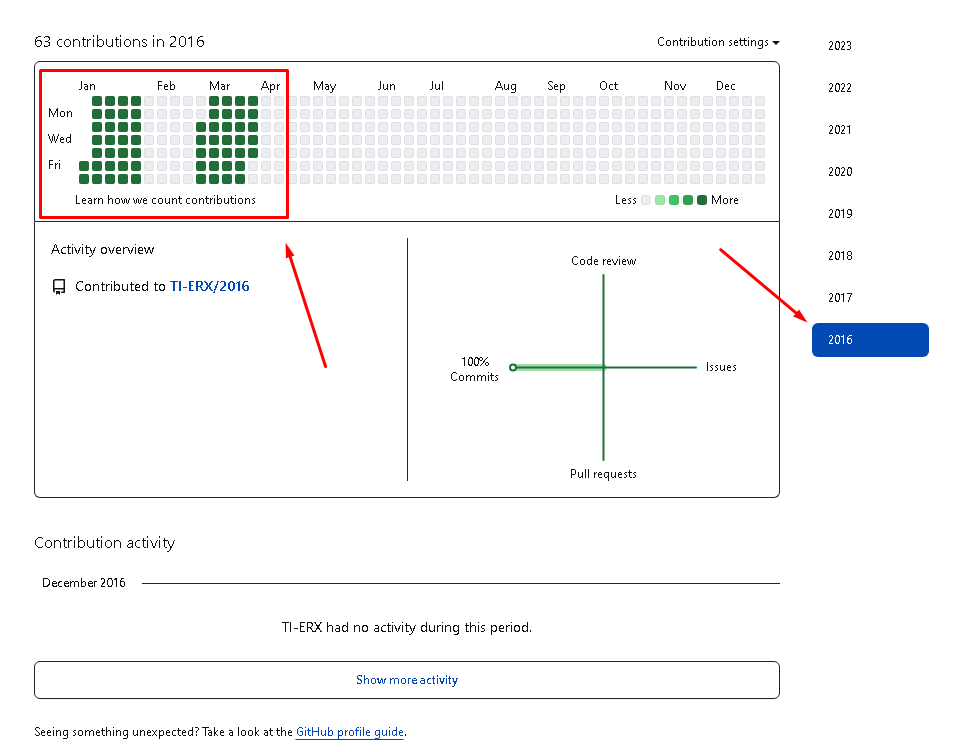
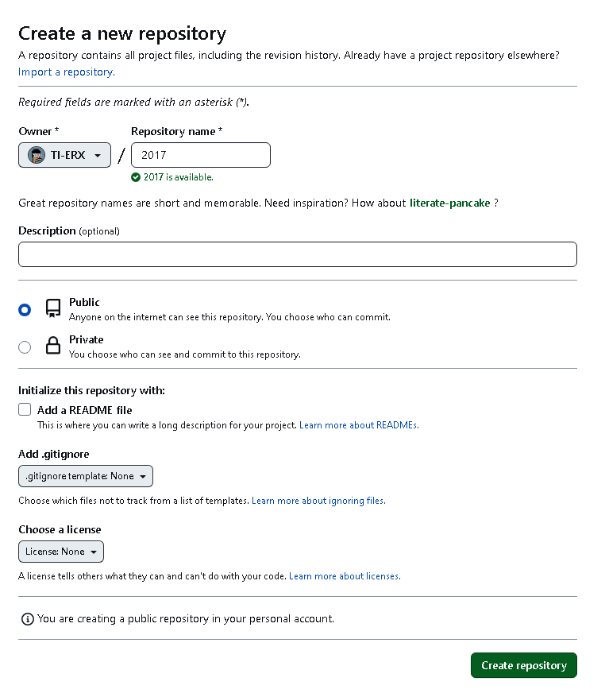
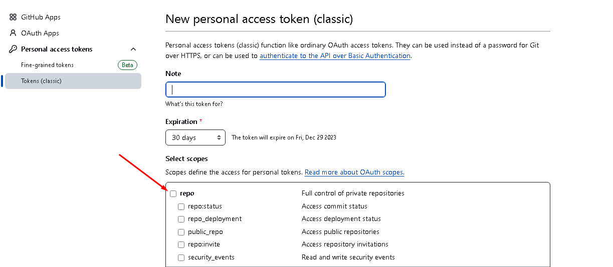
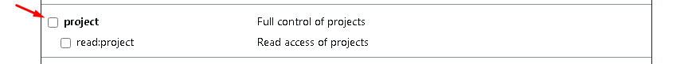

# GitHub History Back

Make your GitHub history go back as far as you want.



# First step

[Create a new repository](https://github.com/new) with the date you wish to travel back in time. Example `2017`



# Second step

[Generate a personal access token](https://github.com/settings/tokens/new) GitHub and copy it. Example below.






# Third step

If you want to generate several, run the script below

```bash
sh -c "$(curl -fsSL https://raw.github.com/TI-ERX/script-several-commits/master/index.sh)"
```

<br>

If you want to generate just one commit, run the script below

```bash
sh -c "$(curl -fsSL https://raw.github.com/TI-ERX/script-only-commit/master/index.sh)"
```
<br> 

Enter your GitHub username and access token and you're ready :)

<br>

### [Script V.1](https://github.com/TI-ERX/script-only-commit) Script to generate just one commit

<br>

# Codes 

### Script that generates only one commit in README.md

```bash
#!/usr/bin/env sh

_() {
  YEAR="2017"
  echo "GitHub Username: "
  read -r USERNAME
  echo "GitHub Access token: "
  read -r ACCESS_TOKEN

  [ -z "$USERNAME" ] && exit 1
  [ -z "$ACCESS_TOKEN" ] && exit 1  
  [ ! -d $YEAR ] && mkdir $YEAR

  cd "${YEAR}" || exit
  git init
  echo "**${YEAR}** - Generate by https://github.com/TI-ERX/script-only-commit" \
    >README.md
  git add .
  GIT_AUTHOR_DATE="${YEAR}-01-01T18:00:00" \
    GIT_COMMITTER_DATE="${YEAR}-01-01T18:00:00" \
    git commit -m "${YEAR}"
  git remote add origin "https://${ACCESS_TOKEN}@github.com/${USERNAME}/${YEAR}.git"
  git branch -M main
  git push -u origin main -f
  cd ..
  rm -rf "${YEAR}"

  echo
  echo "Good, now check your profile: https://github.com/${USERNAME}"
} && _

unset -f _
```


### Script that generates multiple commits at once

```bash
#!/usr/bin/env sh

_() {
  YEAR="2017"
  echo "GitHub Username: "
  read -r USERNAME
  echo "GitHub Access token: "
  read -r ACCESS_TOKEN

  [ -z "$USERNAME" ] && exit 1
  [ -z "$ACCESS_TOKEN" ] && exit 1  
  [ ! -d $YEAR ] && mkdir $YEAR

  cd "${YEAR}" || exit
  git init
  git config core.autocrlf false  # Disables automatic CRLF conversion on Windows
  echo "**${YEAR}** - Generate by https://github.com/TI-ERX/script-several-commits" \
    >README.md
  git add README.md
  
  # Commit for the days of March
  for DAY in {1..31}
  do
    # Checks if the day is in March
    if [ $DAY -ge 1 ] && [ $DAY -le 31 ]; then
      echo "Content for ${YEAR}-03-${DAY}" > "day${DAY}.txt"
      git add "day${DAY}.txt"
      GIT_AUTHOR_DATE="${YEAR}-03-${DAY}T18:00:00" \
        GIT_COMMITTER_DATE="${YEAR}-03-${DAY}T18:00:00" \
        git commit -m "Commit for ${YEAR}-03-${DAY}"
    fi
  done

  git remote add origin "https://${ACCESS_TOKEN}@github.com/${USERNAME}/${YEAR}.git"
  git branch -M main
  git push -u origin main -f
  cd ..
  rm -rf "${YEAR}"

  echo
  echo "Good, now check your profile: https://github.com/${USERNAME}"
} && _

unset -f _
```

<details>
  <summary><h1> Explanation</h1></summary>
  
## Script that generates only one commit in README.md
This script is designed to create a single commit in a Git repository. It prompts the user for their GitHub username and access token. The script then initializes a Git repository, creates a directory with the specified year (2017 in this case), adds a README.md file with a specific format, commits the changes, adds a remote repository on GitHub, and pushes the commit to the GitHub repository. After completion, the local directory is removed.

## Script that generates multiple commits at once
This script is designed to generate multiple commits in a Git repository. Similar to the previous script, it prompts the user for their GitHub username and access token. It initializes a Git repository, sets a configuration to disable automatic CRLF conversion on Windows, adds a README.md file, and then creates commits for each day in March. The content of each commit is stored in separate text files (day1.txt, day2.txt, etc.). The script then adds a remote repository on GitHub and pushes the commits. After completion, the local directory is removed.

Both scripts provide a link to the user's GitHub profile for verification. The first script generates a single commit, while the second script generates multiple commits, each corresponding to a day in March.

</details>
